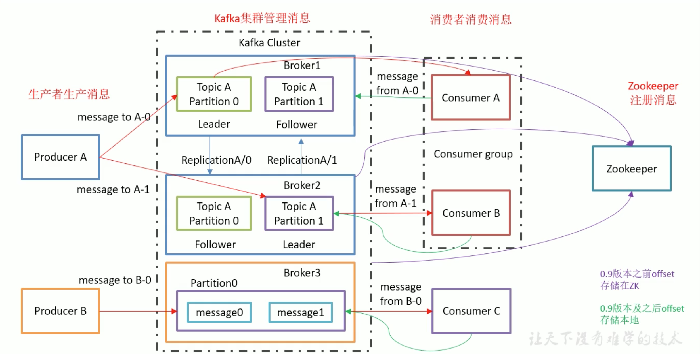
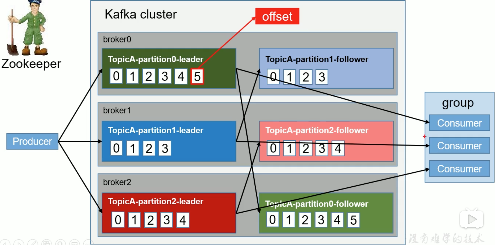
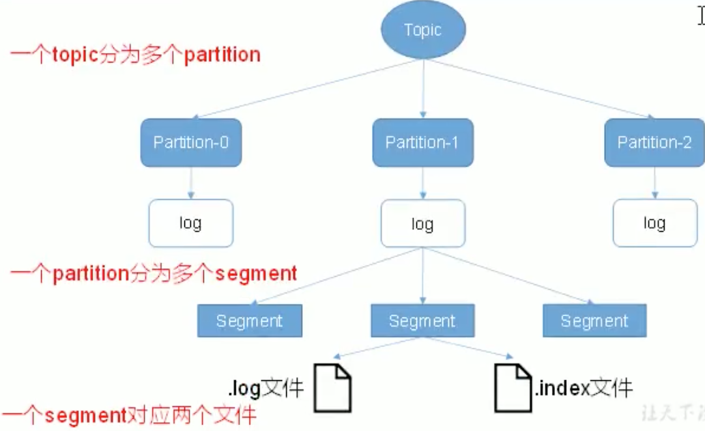
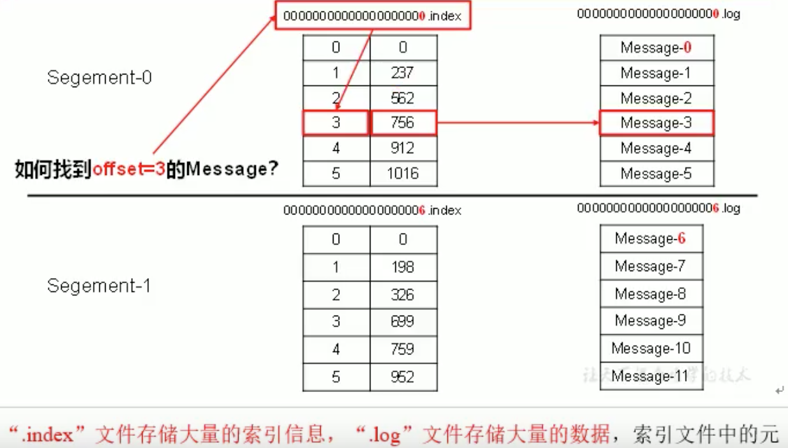
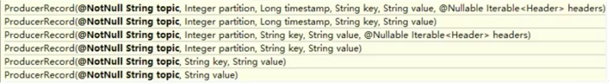

### kafka

​		[中文文档](http://kafka.apachecn.org/)

#### 消息队列

##### 使用优点

* 解耦

  允许独立的扩展或修改两边的处理过程，只要确保它们遵守同样的接口约束

* 可恢复性

  系统一部分组件失效时不会影响到整个系统。一个处理消息的进程挂掉，加入队列的消息仍然可以在系统恢复后被处理

* 缓冲

  有助于处理和优化数据流经过系统的数据，解决生产信息和消费信息的处理速度不一致问题

* 灵活性&峰值处理能力

  使用消息队列能够使关键组件顶住突发的访问压力，不会因为突发的超负荷的请求而完全崩溃

* 异步通信

##### 消息队列的两种模式

* 点对点模式：消费者主动拉取，消息收到后会清除消息

* 发布/订阅模式     

  kafka是主动拉取模式，消费者消费数据之后不会清除消息


#### kafka架构



* Broker：一台kafka机器就是一个Broker，一个集群由多个broker组成，一个broker可以容纳多个topic
* Partition：为了实现扩展性，一个非常大的topic可以分布到多个broker上去，一个topic可以分为多个partition，每个partition都是一个有序的队列

##### kafka工作流程



##### kafka文件存储



​		由于 生产者生产的消息会不断地追加到log文件末尾，为防止log文件过大导致数据定位效率低下，kafka采用**分片和索引**机制，将每个partition分为多个segment，每个segment对应两个文件，“.index” 和 “.log”文件，这些文件位于一个文件夹下，该文件夹的命名规则为：topic名+分区序号，eg：first这个topic有三个分区，则对应文件夹为：first-0，first-1，first-2

​		index和log文件以当前segment 第一条消息的offset命名

1. **index文件和log文件**



#### kafka生产者

##### 分区策略

为了方便在集群中扩展和提高并发

* 分区原则：

  将producer发送的数据要封装成一个ProducerRecord对象

  

  ​		在选择k-v形式的接口，将key的hash值与topic的pertition数进行取余得到partition的值

  ​		参数只有value时，第一次调用随机生成一个整数(后面每次调用都在这个整数上自增)，将这个值与topic可用的partition总数取余得到partition的值

##### 数据可靠性保证

​		topic的每个partition收到producer发送的数据后，都需要向producer发送ack（确认收到），如果producer收到ack，就会进行下一轮的发送，否则会重新发送数据

##### acks参数设置

​		对于某些不重要的数据，即可靠性要求不高，能够容忍数据的少量丢失，没必要等ISR中的follower全部接收成功，kafka提供三种可靠性级别

* acks=0

  ​		producer不等待broker的ack，当broker故障时可能有**数据丢失**

* acks=1

  ​		producer等待broker的ack，partition的leader落盘成功后返回ack，如果在follower同步成功之前leader故障，会有**数据丢失**

* acks=-1、all

  ​		producer等待broker的ack，partition的leader和follower（ISR中的）全部落盘成功后返回ack，但是在follower同步完成后leader故障，则会发生**数据重复**

##### Exactly Once

​		数据不丢失且去重

​		kafka0.11版本引入“幂等性”，即就是producer无论向server发送多少次重复数据，server端只会持久化一条，**At Least Once + 幂等性 = Exactly Once**

​		启用幂等性，将Producer中的参数**enable.idompotence**设置为true，其实质就是将原来下游需要做的去重放在了数据上游。开启幂等性的Producer爱初始化的时候会被分配一个PID，发往同一个Partition 的消息会附带上Sequence Number。Broker端会对<PID，Partition，SeqNumber>做缓存，当具有相同主键 的消息提交时，Broker只会持久化一条

​		PID重启会发生变化，幂等性无法保证跨分区跨会话的Exactly Once

1. 写入方式

   ​		producer 采用推（push）模式将消息发布到 broker，每条消息都被追加（append）到分

   区（patition）中，属于**顺序写磁盘**（顺序写磁盘效率比随机写内存要高，保障 kafka 吞吐率）。

##### 生产者ISR

​		何时producer会收到ack，有两种方案：”半数以上的Follower完成同步就发送ack“和“全部Follower完成同步就发送ack”，kafka采用后者，虽然网络延迟高，但是在选举新的leader时，需容忍n台节点的故障，只需要n+1个副本，且网络延迟对kafka影响较小  

​		同步策略存在问题：所有的Follower开始同步数据，要是有一个Follower因为某种故障，迟迟不能与leader进行同步，那leader就要一直等下去，直到完成同步，才能发送ack

​		对同步策略进行优化，采用ISR：leader维护了一个动态的in-sync replica set，指和leader保持同步的Follower集合。当ISR中的Follower完成数据的同步之后，leader就发送ack，如果Follower长时间未向leader同步数据，则它会被ISR踢出集合，时间阈值由**replica.lag.time.max.ms**参数设定。leader发生故障后，就会从ISR中选举新的leader

##### 数据一致性问题

​		涉及到的故障处理细节，解决故障之后，leader及多个Follower之间数据不一致问题，否则会造成消费数据混乱。即log文件中的HW和LEO

* HW（high Watermark）

  ​		消费者能见到的最大的offset，ISR队列中最小的LEO

* LEO

  ​		每个副本最大的offset

* 存储数据一致性问题，leader发生故障

  ​		从ISR中选出一个新的leader，为保证多个副本之间的数据一致性问题，其余的Follower会先将各自的log文件高于HW那部分截掉，然后从新的leader同步数据

#### kafka消费者

##### 分区分配策略

​		即确定那个partition由那个consumer来消费，有两种策略:

* RoundRobin 轮询

  当前消费者组中的所有消费者订阅的主题是一样的（实际中一个消费者组代表一个业务需求）

* Range（默认）

  按照单个topic来分配

  当消费者组里面的消费者个数发生改变的时候，会触发重新分配

##### offset的维护

​		由消费者group+topic+partition唯一确定一个offset，0.9版本开始，consumer默认将offset保存在kafka一个内置的topic中，该topic为：_consumer_offsets

​		修改comsumer配置文件即consumer.properties

```shell
#本人电脑配置文件路径：/usr/local/etc/kafa/consumer.properties
增加：exclude.internal.topics = false 除了内部topic
```

读取/消费offset

```shell
#在kafka目录下
kafka-console-consumer.sh _consumer_offsets --zookeeper 群名:端口号 --formatter ”kafka.coordinator.group.GroupMetadataManager\$OffsetsMessageFormatter“ --consumer.config config/consumer.properties --from-begining
```

####  安装&练习

1. 安装：brew install kafka

   ​           默认位置：/usr/local/Cellar/kafka       配置文件路径：/usr/local/etc/kafa/server.properties

2. 启动：

   ```java
   zookeeper-server-start /usr/local/etc/kafka/zookeeper.properties
   kafka-server-start /usr/local/etc/kafka/server.properties
   //不会显示启动日志  
   kafka-server-start -daemon /usr/local/etc/kafka/server.properties  
   ```

3. 创建单区的topic即test

   ```java
   kafka-topics --create --zookeeper localhost:2181 --replication-factor 1 --partitions 1 --topic test
   //查看topic
   kafka-topics --list --zookeeper localhost:2181
   ```

4. 创建生产者：

   ```java
   kafka-console-producer --broker-list localhost:9092 --topic test
   或者
   kafka-console-producer.sh --topic test --broker-list 集群名:9092     
   ```

5. 创建消费者

   ```java
   //从头开始消费
   kafka-console-consumer --bootstrap-server localhost:9092 --topic test --from-beginning
   或者
   //从连接时开始消费  
   kafka-console-consume.sh --topic test --bootstrap-server 集群名:9092    
   ```

6. 启动消费者（同一group下多个消费者）

```shell
#修改consumer.properties配置
group.id=组名

kafka-console-consume.sh --topic test --bootstrap-server 集群名:9092 --consumer.config
config/consumer.properties
或者
kafka-console-consume.sh --zookeeper 集群名:端口号 --topic test --consumer.config
config/consumer.properties
```

##### 修改配置文件

```shell
# broker的全局唯一编号，不能重复
broker.id=0
#处理网络请求的线程数量  
num.network.threads=3
#处理磁盘io的线程数量
num.io.threads=8
#发送套接字的缓冲区大小
socket.send.buffer.bytes=102400
#请求套接字的缓冲区大小
socket.request.max.bytes=104857600
# kafka运行日志的存放路径（暂存数据）
log.dirs=/usr/local/var/lib/kafka-logs
# the brokers.topic在当前brokers上的分区数
num.partitions=1
#用来恢复和清理data下数据的线程数
num.recovery.threads.per.data.dir=1  
# segment文件保留的最长时间，超时将被删除
log.retention.hours=168
# 配置连接zookeeper集群地址
zookeeper.connect=localhost:2181  

#分发文件  
使用xsync filename就能将filename分发到集群中的各个节点中  
```


##### 启动脚本-群起群关

```shell
#!/bin/bash

case $1 in
"start"){
		for i in 群1 群2 群3...
		do
		  #全路径
			ssh $i "kafka-server-start /usr/local/etc/kafka/server.properties"
		done
};;

"stop"){
		for in 群1 群2 群3...
		do
			ssh $i "kafka-server-stop"
		done
};;
esac

保存文件，并给予权限chmod 777 文件名.sh
```

#### 相关命令

* 查看某个集群的topic

  kafka-topics.sh --list --zookeeper 集群名:端口号 

* 创建topic

  kafka-topics.sh --create --zookeeper 集群名:端口号  --topic 主题名 --partitions 2 --replication-factor 2

* 删除topic

  kafka-topics.sh --delete --zookeeper 集群名:端口号  --topic 主题名 

* 某个topic的详细信息

  kafka-topics.sh --describe --topic 主题名  --zookeeper 集群名:端口号  

### Kafka-streams

**WordCountApplication**

```java
package kafka;

import java.util.Arrays;
import java.util.Locale;
import java.util.Properties;
import java.util.regex.Pattern;

import org.apache.kafka.common.serialization.Serdes;
import org.apache.kafka.common.utils.Bytes;
import org.apache.kafka.streams.KafkaStreams;
import org.apache.kafka.streams.StreamsConfig;
import org.apache.kafka.streams.kstream.KStream;
import org.apache.kafka.streams.kstream.Materialized;
import org.apache.kafka.streams.state.KeyValueStore;
import org.apache.kafka.streams.kstream.KTable;
import org.apache.kafka.streams.kstream.Produced;
import org.apache.kafka.streams.StreamsBuilder;

/**
 * @author jiabiying <jiabiying@kuaishou.com>
 * Created on 2020-01-17
 */

public class WordCountApplication {

    public static void main(final String[] args) {
        Properties props = new Properties();
        props.put(StreamsConfig.APPLICATION_ID_CONFIG, "kafka-word-count");
        props.put(StreamsConfig.BOOTSTRAP_SERVERS_CONFIG, "localhost:9092");
        props.put(StreamsConfig.DEFAULT_KEY_SERDE_CLASS_CONFIG, Serdes.String().getClass());
        props.put(StreamsConfig.DEFAULT_VALUE_SERDE_CLASS_CONFIG, Serdes.String().getClass());

        StreamsBuilder builder = new StreamsBuilder();
        //使用默认的拓扑从word-count-input-topic中创建源
        KStream<String, String> textLines = builder.stream("word-count-input-topic");
        KTable<String, Long> wordCounts = textLines
                .flatMapValues(textLine -> Arrays.asList(textLine.toLowerCase().split("\\W+")))
                .groupBy((key, word) -> word)
                .count(Materialized.<String, Long, KeyValueStore<Bytes, byte[]>> as("counts-store"));
        wordCounts.toStream().to("word-count-output-topic", Produced.with(Serdes.String(), Serdes.Long()));

        KafkaStreams streams = new KafkaStreams(builder.build(), props);
        streams.start();
    }
}
```

* 解析

  ```java
  <KR, VR> KStream<KR, VR> flatMap(KeyValueMapper<? super K, ? super V, ? extends Iterable<? extends KeyValue<? extends KR, ? extends VR>>> var1);
  
   <VR> KStream<K, VR> flatMapValues(ValueMapper<? super V, ? extends Iterable<? extends VR>> var1);
  
  <VR> KStream<K, VR> flatMapValues(ValueMapperWithKey<? super K, ? super V, ? extends Iterable<? extends VR>> var1);
  ```

  K，V：这一对是指原始流中的键值对；
  KR，VR：这一对指的是结果流中的键值对。
          flatMap是将输入流中的每一条记录转成输出流中的0个或者多个记录。例如，输入流中的一条记录<K,V>经过flatMap后变成<K':V'>, <K'':V''>, ...成为了输出流中的多条记录。

  ​        而flatMapValues则不同，flatMapValues是将输入流中的一条记录转成输出流中有着相同Key值的0个或多个记录。例如，输入流中的一条记录<K,V>经过flatMapValues后变成了<K:V'>, <K:V''>, ...成为了输出流中相同K的多条记录

  ​		ValueMapper是将一个value映射成一个新的value；

  ​		KeyValueMapper是将一个key-value键值对映射成一个新的key-value键值对，其中的key和value都是可以修改的

  ​		ValueMapperWithKey是将一个value映射成一个新的value与valueMapper的区别是ValueMapperWithKey会在apply方法中带着只读的Key

  ​		groupBy和count，就类似SQL中的操作一样。groupBy操作会重新组织流中的数据，并且使用KeyValueMapper提供的值作为新Key，这个过程中Kafka Streams会在kafka cluster上生成一个叫做${applicationId}-XXX-repartition的新topic。最后count方法会根据组织好的key统计流中的出现次数

* 步骤

1. 将其打成jar包
2. 启动kafka
3. 创建input topic
   kafka-topics.sh --zookeeper localhost:2181 --create --topic word-count-input-topic --partitions 1 --replication-factor 1
4. 为该topic生成一些文本
   bin/kafka-console-producer.sh --broker-list localhost:9092 --topic word-count-input-topic
5. 运行jar
   java -cp ***.jar  全限类名
6. consumer查看结果
   bin/kafka-console-consumer.sh --topic word-count-output-topic --from-beginning --bootstrap-server localhost:9092 --property print.key=true